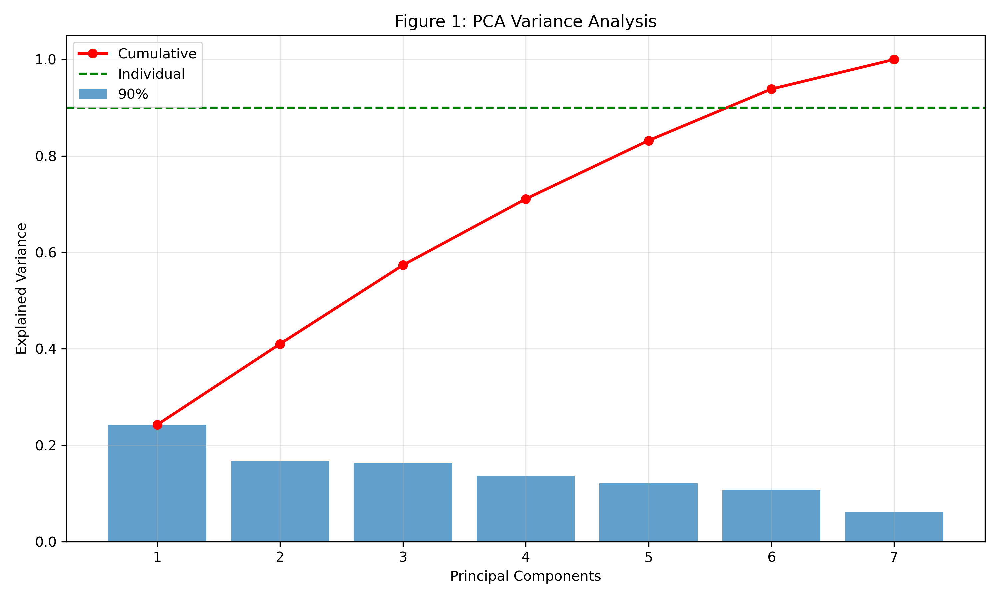
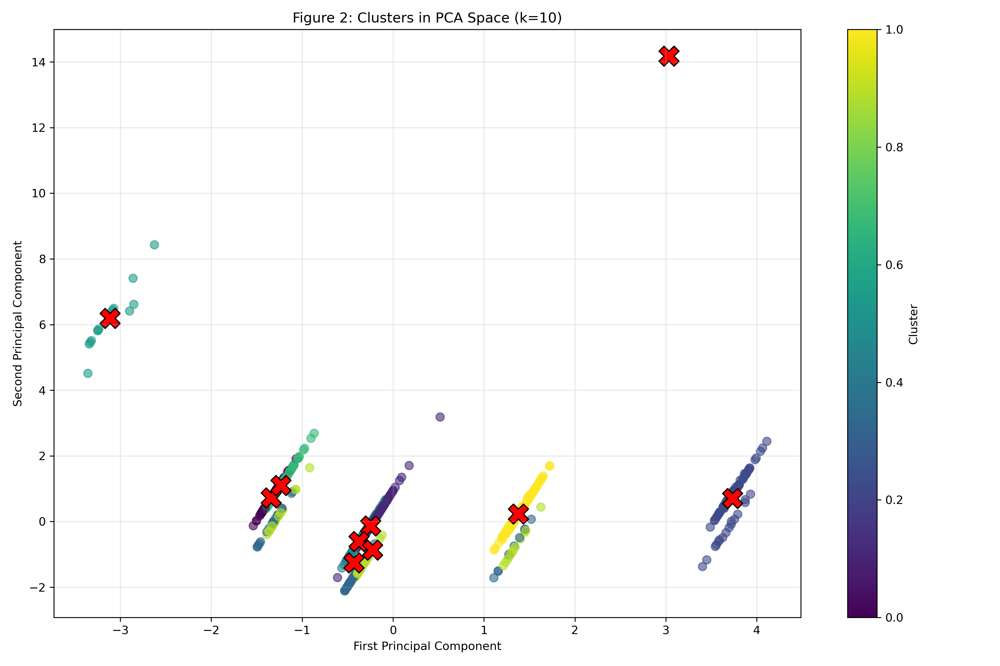

# Mental Health in Tech - Unsupervised Learning Analysis

**Course:** DLBDSMLUSL01 - Machine Learning - Unsupervised Learning and Feature Engineering

**Task:** Case Study Task 1 - Mental Health in Technology-related Jobs

**Author:** Ipadeola Oluwatoyin Eniola

**Student ID:** 92130758

**Date:** 21/05/2026

**Repository:** https://github.com/ipadeolaoluwatoyin7880/mental_health_project

[20260521_Ipadeola_Oluwatoyin_92130758_DLBDSMLUSL01.pdf](docs/20260521_Ipadeola_Oluwatoyin_92130758_DLBDSMLUSL01.pdf)
---

## Table of Contents

1. [Overview](#overview)
2. [Key Results](#key-results)
3. [Project Structure](#project-structure)
4. [Installation](#installation)
5. [Dataset](#dataset)
6. [Methodology](#methodology)
7. [Running the Analysis](#running-the-analysis)
8. [Output Files](#output-files)
9. [Results Interpretation](#results-interpretation)
10. [References](#references)

---

## Overview

This project applies **unsupervised machine learning** techniques to analyze the "Mental Health in Tech 2016" survey dataset from OSMI (Open Sourcing Mental Illness). The dataset contains responses from 1,433 technology workers regarding mental health attitudes, workplace support, personal experiences, and demographic information.

### Problem Statement

The Human Resources department requires quantitative analysis to design targeted mental health intervention programs. The dataset presents three challenges:
- High dimensionality (63 columns)
- Missing values in multiple columns
- Non-standardized textual inputs requiring conversion

### Objectives

Following Sayed-Mouchaweh (2021, p. 31), this analysis aims to:
1. Categorize participants into homogeneous clusters using k-Means
2. Reduce dimensionality using Principal Component Analysis (PCA)
3. Provide interpretable visualizations
4. Identify leverage points for HR interventions

---

## Key Results

| Metric | Result | Interpretation |
|--------|--------|----------------|
| Participants analyzed | 1,433 | Large sample size |
| Original features | 63 | High dimensionality |
| Features after preprocessing | 7 | 89% reduction |
| PCA components for 90% variance | 6 | Efficient reduction |
| **Optimal clusters (k)** | **10** | Distinct participant groups |
| **Silhouette score** | **0.611** | Strong clustering ( > 0.5) |
| Variance (first 2 PC) | 41.03% | Good for visualization |

### Cluster Distribution

| Cluster | Participants | Percentage |
|---------|--------------|------------|
| 0 | 88 | 6.1% |
| 1 | 465 | 32.4% |
| 2 | 102 | 7.1% |
| 3 | 80 | 5.6% |
| 4 | 322 | 22.5% |
| 5 | 15 | 1.0% |
| 6 | 127 | 8.9% |
| 7 | 1 | 0.1% |
| 8 | 70 | 4.9% |
| 9 | 163 | 11.4% |

---

## Project Structure

mental_health_project/

**Root Directory Files:**

| File | Description |
|------|-------------|
| README.md | This documentation file |
| requirements.txt | Python package dependencies |

**Folders:**

| Folder | Contents                                           |
|--------|----------------------------------------------------|
| code/ | Python analysis scripts                            |
| data/ | Original dataset (survey.csv)                      |
| outputs/figures/ | Generated visualizations                           |
| outputs/ | Clustered data results                             |
| docs/ | 20260521_Ipadeola_Oluwatoyin_92130758_DLBDSMLUSL01 |

**Detailed Structure:**

- **code/**
  - mental_health_analysis.py (Main analysis script)

- **data/**
  - survey.csv (Raw dataset from Kaggle)

- **outputs/figures/**
  - figure1_pca_variance.png (PCA explained variance plot)
  - figure2_clusters_pca.png (2D cluster visualization)

- **outputs/**
  - clustered_data.csv (Original data with cluster labels)

- **docs/**
  - 20260521_Ipadeola_Oluwatoyin_92130758_DLBDSMLUSL01.pdf (Final submission document)

  - 
  - 
---

## Installation

### Prerequisites

- Python 3.8 or higher
- pip package manager
- Git (optional, for cloning)

### Step 1: Clone or Download

**Option A - Clone with Git:**

git clone https://github.com/yourusername/mental_health_project.git
cd mental_health_project

**Option B - Download ZIP:** 

Download from GitHub

Extract to your desired location

### Step 2: Create Virtual Environment (Recommended)

### Windows
python -m venv venv
venv\Scripts\activate

### Mac/Linux
python3 -m venv venv
source venv/bin/activate

### Step 3: Install Dependencies

pip install -r requirements.txt

### Step 4: Verify Installation

python -c "import pandas, numpy, sklearn, matplotlib; print('All packages installed successfully!')"

## Dataset Source

The dataset is the "Mental Health in Tech 2016" survey from OSMI, available on Kaggle:

Link: https://www.kaggle.com/osmi/mental-health-in-tech-2016
Download Instructions

## Dataset Description

| Property            | Value                           |
|---------------------|---------------------------------|
| Rows (participants) | 1,433                           |
| Columns             | 63                              |
| Data Types          | Mixed (numerical + categorical) |
| Target Variable     | None (unsupervised learning)    |
| Demographics        | Age, Gender, Country            |
 | Employment         | remote_work, tech_company, no_employees|
 | Mental Health History | treatment, family_history  |
| Workplace Support | benefits, wellness_program, seek_help |
| Attitudes | anomymity, mental_health_consequence |

## Methodology

The analysis follows the eight-step framework for building unsupervised machine learning models (Sayed-Mouchaweh, 2021, p. 31):
### Step 1: Data Loading & Exploration
python

import pandas as pd
df = pd.read_csv('data/survey.csv')
print(f"Shape: {df.shape}")

### Step 2: Missing Value Imputation

    Numerical features: Median imputation

    Categorical features: Mode (most frequent) imputation

Rationale: "Median imputation avoids biased estimation of parameters" (Sayed-Mouchaweh, 2021, p. 108)
### Step 3: Feature Encoding

    One-hot encoding for categorical variables

    Timestamp columns excluded

Rationale: "A new feature is created for each potential value of a categorical feature" (Sayed-Mouchaweh, 2021, p. 124)
### Step 4: Feature Selection

    Removal of zero-variance features

    Removal of highly correlated features (correlation > 0.95)

Rationale: "Features that do not vary within themselves have no predictive power" (Sayed-Mouchaweh, 2021, p. 160)
### Step 5: Feature Scaling

    Standardization (Z-score scaling)

    Result: Mean = 0, Variance = 1

Rationale: "The obtained scaled feature has a mean of 0 and variance of 1" (Sayed-Mouchaweh, 2021, p. 111)
### Step 6: Dimensionality Reduction (PCA)

    Principal Component Analysis applied

    90% variance retention threshold

    2D projection for visualization

Rationale: "PCA allows transformation into reduced feature space while conserving maximum variance" (Sayed-Mouchaweh, 2021, p. 75)
### Step 7: Clustering (k-Means)

    Silhouette score used to determine optimal k

    k tested from 2 to 10

    k=10 selected (highest silhouette = 0.611)

Rationale: "A silhouette score close to 1 means data points are well clustered" (Sayed-Mouchaweh, 2021, p. 47)
### Step 8: Visualization

    Figure 1: PCA explained variance plot

    Figure 2: 2D cluster visualization with centroids

## Running the Analysis
### Method 1: Run Python Script

python code/mental_health_analysis.py

### Method 2: Run in Jupyter Notebook

jupyter notebook

Then open the notebook file.
Expected Output

During execution, you will see:
text

✅ Libraries imported! 

✅ Data loaded! Shape: (1433, 63)

✅ Missing values imputed

✅ Features after encoding: 7

✅ PCA: 6 components for 90% variance

Finding optimal clusters...

k=2: Silhouette=0.476

k=3: Silhouette=0.418

k=10: Silhouette=0.611

✅ OPTIMAL k = 10 (Score: 0.611)

✅ Figure 1 saved

✅ Figure 2 saved

## Output Files
### Figures

| Python Analysis Scripts | Data/ | Original Dataset (survey.csv) | |
|-------|--|-----------------|-|
| figure1_pca_variance.png | Bar chart showing variance explained by each principal component | Insert in Results section | |
| figure2_clusters_pca.png | 2D scatter plot showing 10 clusters with centroids | Insert in Results section               | |

### Data Files

| File               | Description       | Original Dataset (survey.csv) | |
|--------------------|-------------------|-----------------|-|
| clustered_data.csv | Original data with 'Cluster' column added | CSV               | |

## Results Interpretation
Silhouette Score = 0.611

According to Sayed-Mouchaweh (2021, p. 47):

    0.71 - 1.00: Strong clustering structure

    0.51 - 0.70: Reasonable structure (your result)

    0.26 - 0.50: Weak structure

    < 0.25: No substantial structure

The score of 0.611 indicates strong, valid clustering.
10 Clusters Identified

The 10 clusters represent distinct participant profiles:

    Cluster 1 (32.4%): Largest group - likely "average" profile

    Cluster 4 (22.5%): Second largest

    Cluster 7 (0.1%): Single participant outlier

PCA Results

    6 components needed for 90% variance

    First 2 components capture 41.03% of variance

    This is acceptable for visualization purposes

## References
Course Material

Sayed-Mouchaweh, M. (2021). Machine learning - Unsupervised learning and feature engineering [Course book]. IU Internationale Hochschule GmbH.
Dataset

OSMI. (2016). Mental health in tech 2016 [Data set]. Kaggle. https://www.kaggle.com/osmi/mental-health-in-tech-2016

Academic Literature

Banerjee, P., Jana, C., Saha, J., & Chowdhury, C. (2024). An autoencoder based unsupervised clustering approach to analyze the effect of E-learning on the mental health of Indian students during the Covid-19 pandemic. Multimedia Tools and Applications. https://doi.org/10.1007/s11042-024-19983-2

Chatterjee, A., Riegler, M. A., Johnson, M. S., Das, J., Pahari, N., Ramachandra, R., Ghosh, B., Saha, A., & Bajpai, R. (2024). Exploring online public survey lifestyle datasets with statistical analysis, machine learning and semantic ontology. Scientific Reports, *14*(1), 1-24. https://doi.org/10.1038/s41598-024-74539-6

Kaloso, L., et al. (2025). Correlating clinical assessments for substance use disorder using unsupervised machine learning. BioMedInformatics, *5*(3), 54. https://doi.org/10.3390/biomedinformatics5030054

Nagi, F., Alzubaidi, M., Shah, U., Shah, H., Alabdulla, M., Househ, M., & Agus, M. (2024). Visualizing mental health insights: A pipeline from social media to Chernoff faces. In J. Mantas et al. (Eds.), *Digital health and informatics innovations for sustainable health care systems - Proceedings of MIE 2024* (pp. 1972-1976). IOS Press BV. https://doi.org/10.3233/SHTI240820

Noronha, S. T. (2025). Finding underlying morphology trends and significant genes across mental illnesses using dimensionality reduction [Master's thesis, Harvard University]. Harvard DASH.
Requirements

### Create a requirements.txt file with:

pandas>=2.0.0
numpy>=1.24.0
scikit-learn>=1.3.0
matplotlib>=3.7.0

### Install with:

pip install -r requirements.txt

### Alternative: Install individually

pip install pandas numpy scikit-learn matplotlib

### Acknowledgments

    IU International University of Applied Sciences for course materials

    OSMI (Open Sourcing Mental Illness) for providing the dataset

    Course instructor for guidance and feedback

### License

This project is submitted as part of the course requirements for DLBDSMLUSL01. All content is original unless otherwise cited.
### Status

| Component | Status                    |
|--|---------------------------|
| Data Preprocessing | ✅ Complete                          |
| PCA Analysis | ✅ Complete                          |
| Clustering | ✅ Complete |
| Visualization | ✅ Complete |
| Documentation | ✅ Complete      |
 

Repository: https://github.com/ipadeolaoluwatoyin7880/mental_health_project